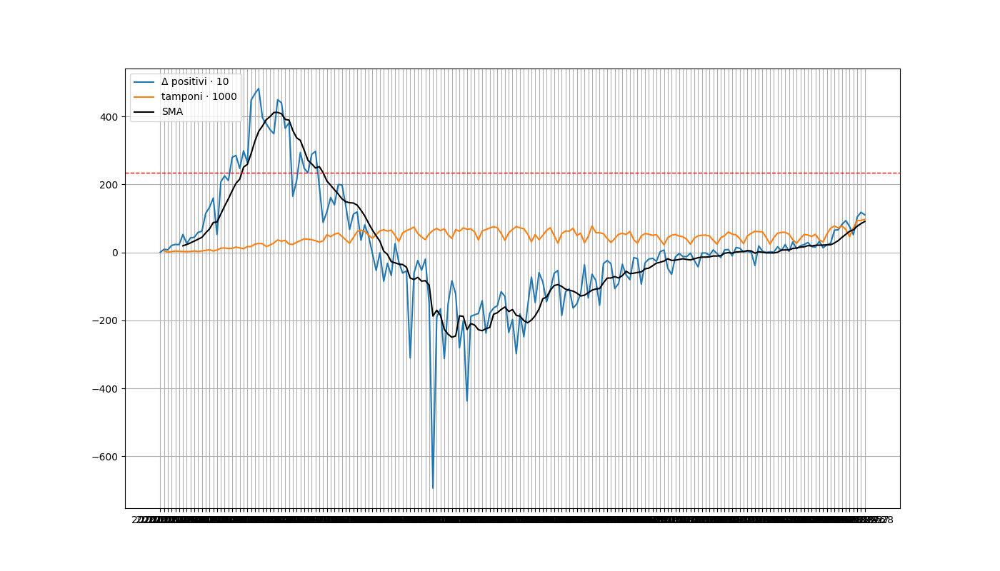
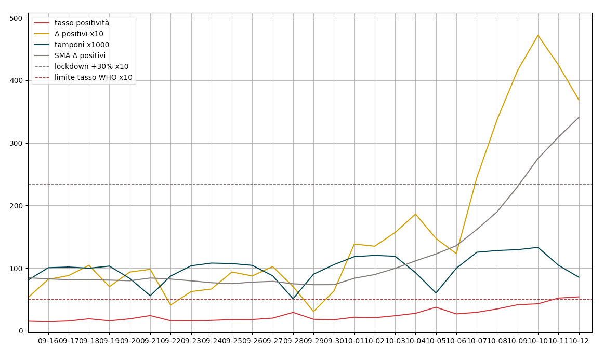

# COVID-stats-ITA
media mobile 7gg sui dati aggiornati dal ministero

la linea tratteggiata mostra il delta che risale al lockdown +30% considerando:
- misure di rallentamento
- ospedali organizzati
- opposizione ad un nuovo lockdown

dati ufficiali: https://github.com/pcm-dpc/COVID-19

# futuri aggiornamenti
- plot ultimi 15gg
- bot telegram
